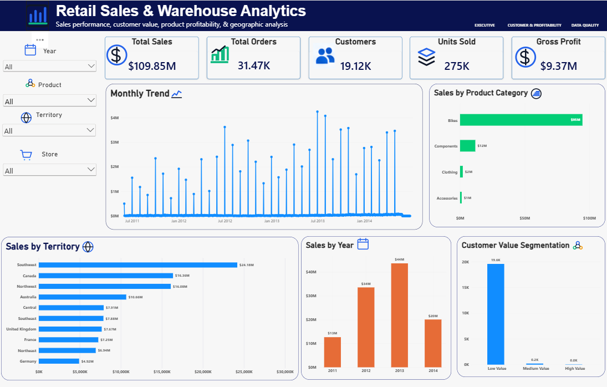
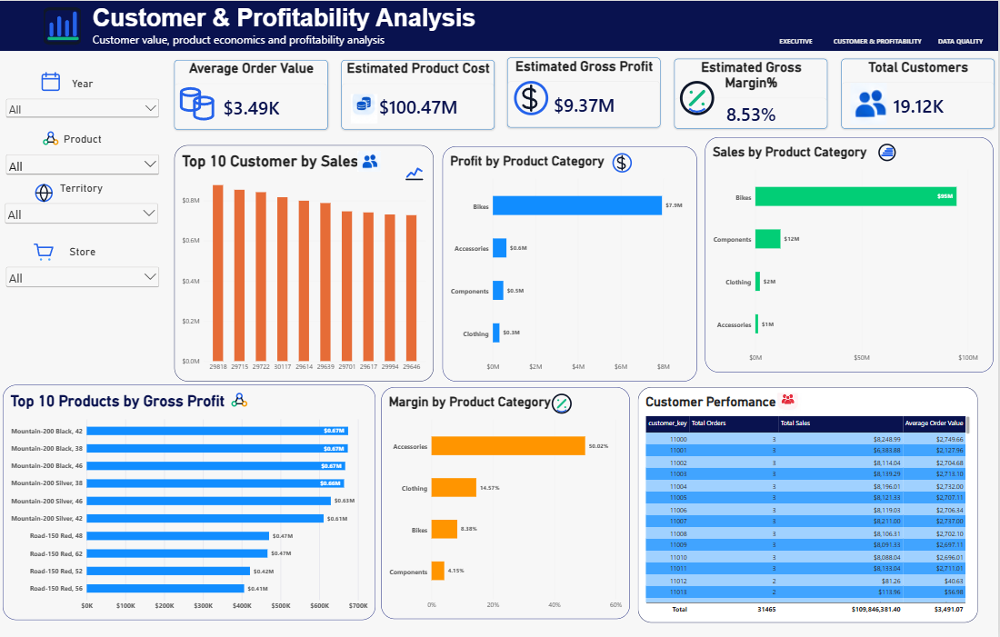
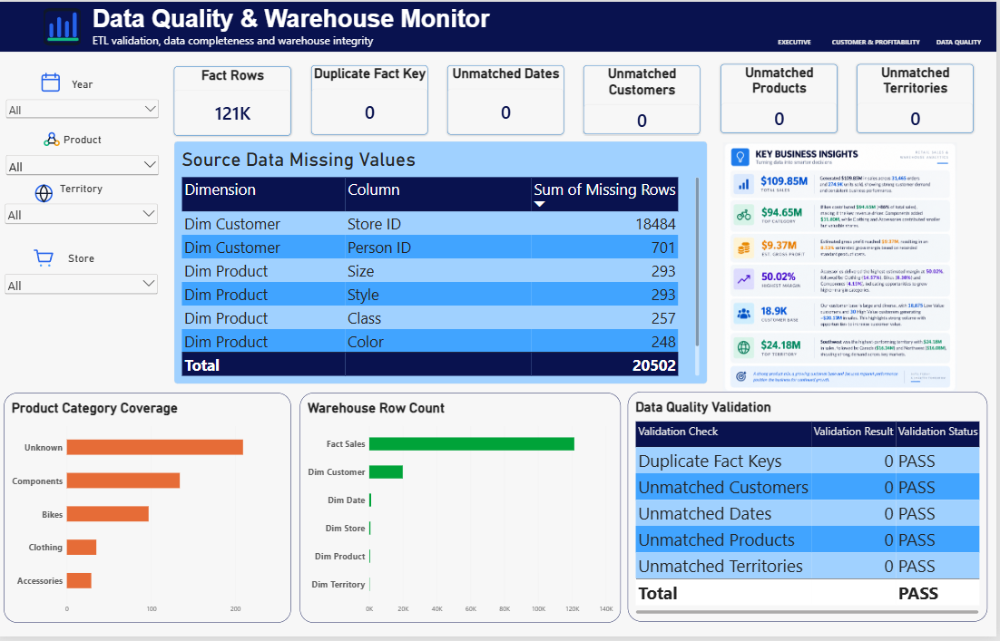

# Retail Data Warehouse & ETL Analytics

## 📊 Project Overview

This project demonstrates an end-to-end retail analytics workflow, from raw CSV data to a structured data warehouse and interactive Power BI dashboards.

The project focuses on:

- Data ingestion and ETL using Python
- Data quality validation
- Dimensional data modeling
- PostgreSQL data warehousing
- SQL-based business analytics
- Customer segmentation
- Product profitability analysis
- Power BI dashboard development

The objective is to transform raw retail transaction data into a reliable analytical warehouse that can support business reporting and decision-making.

---

## 🛠️ Technology Stack

| Technology | Purpose |
|---|---|
| Python / Pandas | Data cleaning, validation and ETL |
| PostgreSQL | Data warehouse |
| SQL | Analytics and validation |
| Power BI | Interactive dashboards |
| DAX | Measures and analytical calculations |
| GitHub | Project version control and documentation |

---

## 🔄 Project Architecture

```text
Raw CSV Files
      ↓
Python / Pandas
      ↓
Data Cleaning & Validation
      ↓
ETL Transformation
      ↓
PostgreSQL Data Warehouse
      ↓
SQL Analytics
      ↓
Power BI Data Model
      ↓
Interactive Dashboards

Retail_Data_Warehouse_ETL_Analytics/
│
├── Data/
│   └── Raw AdventureWorks CSV files
│
├── ETL/
│   ├── dim_date.csv
│   ├── dim_customer.csv
│   ├── dim_store.csv
│   ├── dim_territory.csv
│   ├── dim_product.csv
│   └── fact_sales.csv
│
├── SQL/
│   └── retail_warehouse.sql
│
├── Notebooks/
│   └── retail_etl_analysis.ipynb
│
├── PowerBI/
│   └── Retail_Data_Warehouse_Analytics.pbix
│
├── Screenshots/
│
└── Models/
```

### 🧹 Data Preparation & ETL
The raw dataset contains eight source tables covering customers, sales orders, sales order details, stores, territories, products, product subcategories and product categories.
Source tables
- Sales Customer
- Sales SalesOrderHeader
- Sales SalesOrderDetail
- Sales Store
- Sales SalesTerritory
- Production Product
- Production ProductSubcategory
- Production ProductCategory
Python/Pandas was used to:
1. Load the raw CSV files
2. Inspect table structures and data types
3. Check duplicate records
4. Identify missing values
5. Validate primary keys
6. Validate referential relationships
7. Validate date consistency
8. Validate sales calculations
9. Transform source data into dimensional tables
10. Create the sales fact table
11. Export the transformed tables for PostgreSQL loading


### 🏗️ Data Warehouse Model
The PostgreSQL warehouse follows a star schema.
Fact Table
fact_sales
Grain:
One row per sales order line.

Key measures include:
- Quantity
- Unit Price
- Discount Rate
- Sales Amount
Dimension Tables
- dim_date
- dim_customer
- dim_product
- dim_store
- dim_territory
Model
                    dim_date
                       │
                       │
dim_customer ──── fact_sales ──── dim_product
                       │
                       │
                dim_territory
                       │
                       │
                   dim_store
This structure supports efficient filtering and aggregation in Power BI.

### 🔍 Data Quality Validation
The ETL process included multiple validation checks.
Source-level validation
- Duplicate row checks
- Primary-key uniqueness
- Missing-value analysis
- Foreign-key relationship checks
- Date consistency checks
- Negative-value checks
- Discount validation
- Sales line-total validation
- Order subtotal validation
Warehouse-level validation
The final warehouse was validated for:
- Duplicate fact keys
- Unmatched dates
- Unmatched customers
- Unmatched products
- Unmatched territories
- Unmatched stores where StoreKey is populated
The Power BI Data Quality dashboard shows the warehouse validation results.

### 📊 Warehouse Size
Table	Rows
Fact Sales	121,317
Dim Customer	19,820
Dim Date	1,127
Dim Store	701
Dim Product	504
Dim Territory	10


### 📈 Power BI Dashboard
The Power BI report contains three analytical pages.
1. Retail Sales & Warehouse Analytics
Provides an executive overview of:
- Total sales
- Total orders
- Total customers
- Units sold
- Estimated gross profit
- Monthly sales trends
- Sales by product category
- Sales by territory
- Sales by year
- Customer value segmentation
2. Customer & Profitability Analysis
Focuses on customer value and product economics.
Includes:
- Average Order Value
- Estimated Product Cost
- Estimated Gross Profit
- Estimated Gross Margin
- Top 10 Customers by Sales
- Profit by Product Category
- Sales by Product Category
- Top Products by Gross Profit
- Margin by Product Category
- Customer Performance
3. Data Quality & Warehouse Monitor
Focuses on ETL and warehouse reliability.
Includes:
- Fact row count
- Duplicate fact-key validation
- Unmatched dimension checks
- Source data missing values
- Warehouse row counts
- Data-quality validation
- Product category coverage

# 📸 Dashboard Preview

## Executive Sales Overview



## Customer & Profitability Analysis



## Data Quality & Warehouse Monitor




### 💡 Key Business Findings
Sales Performance
Total sales reached approximately:
$109.85M
across:
- 31,465 orders
- 274,914 units
- 19,119 customers
Product Categories
Bikes were the largest revenue category with approximately:
$94.65M
followed by:
- Components: $11.80M
- Clothing: $2.12M
- Accessories: $1.27M
Profitability
Estimated gross profit was approximately:
$9.37M
with an estimated gross margin of:
8.53%
Profitability is estimated using recorded product standard costs.
Category Margins
- Accessories: 50.02%
- Clothing: 14.57%
- Bikes: 8.38%
- Components: 4.15%
Geographic Performance
Southwest recorded the highest territory sales at approximately:
$24.18M
followed by:
- Canada: $16.34M
- Northwest: $16.08M


### 👥 Customer Segmentation
Customers were segmented using order frequency and total sales.
High Value
- 8+ orders
- $500K+ sales
Medium Value
- 4+ orders
- $100K+ sales
Low Value
- Remaining customers
Results:
Segment	Customers	Total Sales
High Value	30	$20.13M
Medium Value	214	$51.38M
Low Value	18,875	$38.33M


### 💰 Profitability Methodology
Estimated product cost was calculated as:
Estimated Product Cost
= Quantity × Standard Product Cost
Estimated gross profit:
Estimated Gross Profit
= Sales − Estimated Product Cost
Estimated gross margin:
Estimated Gross Margin
= Estimated Gross Profit ÷ Sales
Limitation
The profitability analysis uses the recorded standard product cost rather than historical actual transaction-level cost.
Therefore, gross profit and gross margin should be interpreted as estimated profitability measures.


### 🧪 Data Quality Findings
The source data contained legitimate missing values in several attributes.
Examples include:
- Customer Store ID: 18,484 missing
- Customer Person ID: 701 missing
- Product Size: 293 missing
- Product Style: 293 missing
- Product Class: 257 missing
- Product Color: 248 missing
Missing values were analyzed rather than blindly deleted.
Products without a source product subcategory were retained under an Unknown category so that valid sales records were not removed from the warehouse.


### 📚 Skills Demonstrated
This project demonstrates practical experience with:
Data Engineering
- ETL pipelines
- Data cleaning
- Data validation
- Dimensional modeling
- Star schema design
- Fact and dimension tables
SQL
- Joins
- Aggregations
- CTEs
- CASE statements
- Window-style analytical thinking
- Data-quality validation
- Business KPI calculations
Python
- Pandas
- NumPy
- Data profiling
- Data transformation
- Data validation
- CSV processing
Power BI
- Data modeling
- DAX
- Relationships
- KPI cards
- Interactive dashboards
- Drill/filter analysis
- Data-quality monitoring


### ⚠️ Project Limitations
1. Profitability uses standard product cost rather than historical actual cost.
2. The source dataset does not contain every operational cost required for a complete profitability model.
3. Missing source attributes were retained where appropriate instead of being artificially imputed.
4. Customer segmentation thresholds are analytical rules created for this project and are not official business classifications.
5. The dataset represents a historical retail environment and should not be interpreted as current business performance.


### 🎯 Project Objective
The main objective was to demonstrate how raw transactional data can be transformed into a structured analytical data warehouse and then converted into actionable business insights through SQL and Power BI.


### 👨‍💻 Author
Mohammad Farhan

MBA — Business Analytics & Artificial Intelligence
Middlesex University Dubai
Skills:
Python · SQL · PostgreSQL · Power BI · DAX · Excel · Data Analytics · ETL · Data Warehousing


### 📌 Project Type
End-to-End Data Engineering & Business Analytics Portfolio Project
Python ETL
    +
PostgreSQL Data Warehouse
    +
SQL Analytics
    +
Power BI
    =
Retail Data Warehouse & ETL Analytics

###
